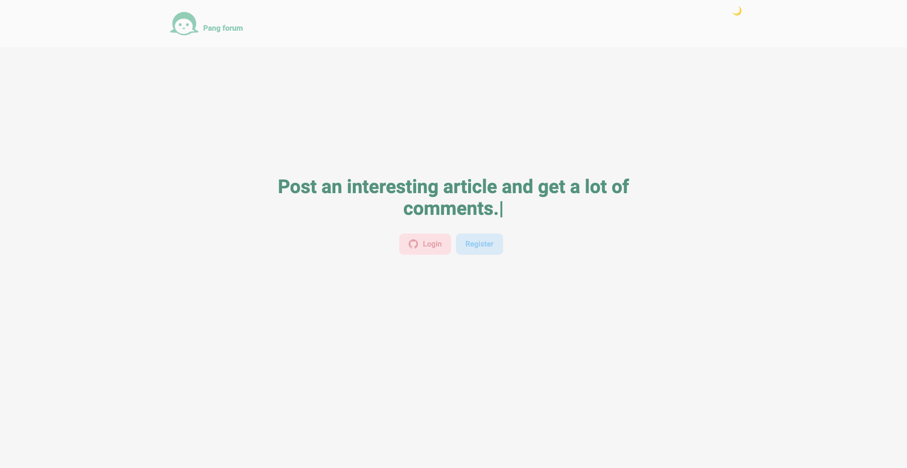

# pang-forum

> 게시글 및 댓글을 자유롭게 작성할 수 있는 웹 사이트입니다.

로그인 후 게시글을 작성하고, 수정/삭제가 가능하며 다른 게시글에 댓글을 작성할 수 있습니다.

### demo

[https://pang-forum2.vercel.app/](https://pang-forum2.vercel.app/)



## 설치 방법

아래 단계를 따라 프로젝트를 설치하세요.

1. 프로젝트를 클론합니다.

   ```bash
   git clone https://github.com/sorate7624/pang-forum.git
   ```

2. 프로젝트 디렉토리로 이동합니다.

   ```bash
   cd pang-forum
   ```

3. 종속성을 설치합니다.

   ```bash
   npm install
   ```

4. 프로젝트를 실행합니다.
   ```bash
   npm run dev
   ```

## 기술 스택

프로젝트의 기술 스택은 다음과 같습니다.

### Development

<div style="display: flex">
  
  
  
  
  <br/>
</div>

### Environment

<div style="display: flex">
  
  
  
  
  
  <br/>
</div>

### Config

<div style="display: flex">
  
  
  
  
  
  <br/>
</div>

## 폴더 구조

프로젝트의 주요 폴더 구조는 다음과 같습니다.

- `app/`: 프로젝트의 소스 코드를 담고 있는 폴더입니다. `page.js`, `layout.js` 파일이 여기에 위치합니다.
  - `detail/`: 게시글 디테일 페이지에 대한 파일들을 담고 있는 폴더입니다.
  - `edit/`: 게시글 수정 페이지에 대한 파일들을 담고 있는 폴더입니다.
  - `list/`: 게시글 목록 페이지에 대한 파일들을 담고 있는 폴더입니다.
  - `register/`: 회원 등록 페이지에 대한 파일들을 담고 있는 폴더입니다.
  - `write/`: 게시글 작성 페이지에 대한 파일들을 담고 있는 폴더입니다.
- `pages/api/`: API 엔드포인트를 생성하고 관리하는 폴더입니다.
  - `auth/`: 인증 관련 엔드포인트를 관리하는 폴더입니다.
  - `comment/`: comment 관련 엔드포인트를 관리하는 폴더입니다.
  - `post/`: post 요청으로 들어오는 엔드포인트들을 관리하는 폴더입니다.
- `public/`: 정적 파일들을 담고 있는 폴더입니다. 이미지 파일들이 여기에 위치합니다.
- `styles/`: 프로젝트의 스타일 파일들을 담고 있는 폴더입니다.
- `util`: 데이터베이스 설정 파일을 담고 있는 폴더입니다.
- `next.config.js`: next.js 프로젝트의 환경 설정과 빌드/런타임 동작을 커스터마이징하는 설정 파일입니다.
- `postcss.config.js`: postcss 설정 파일입니다.
- `jsconfig.json`: 파일 경로의 기본 설정과 모듈 간의 경로를 단축해주는 역할을 합니다.
- `middleware.js`: express.js 애플리케이션에서 미들웨어 함수들을 정의하고 관리하는 파일입니다.

## 업데이트 내역

- 0.0.10
  - 커멘트 전송 후 새로고침 없이 자동 업데이트로 수정
- 0.0.9
  - 회원가입 redirect 오류 수정 및 글 삭제 확인 창 추가
- 0.0.8
  - 모바일용 스타일 추가
- 0.0.7
  - scss파일 소문자로 변경
- 0.0.6
  - npm 캐시 청소
- 0.0.5
  - scss 파일 경로 수정
- 0.0.4
  - import scss 파일 경로 수정
- 0.0.3
  - 다크테마 추가 및 뒤로가기 버튼 추가
- 0.0.2
  - 각 페이지에 스타일 추가
- 0.0.1
  - pang-forum from next.js

## 정보

최혜진 – sorate_@naver.com

[https://github.com/sorate7624/](https://github.com/sorate7624/)

## 기여 방법

1. (<https://github.com/sorate7624/pang-forum/fork>)을 포크합니다.
2. (`git checkout -b feature/fooBar`) 명령어로 새 브랜치를 만드세요.
3. (`git commit -am 'Add some fooBar'`) 명령어로 커밋하세요.
4. (`git push origin feature/fooBar`) 명령어로 브랜치에 푸시하세요.
5. 풀리퀘스트를 보내주세요.
